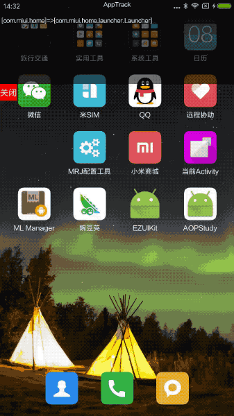
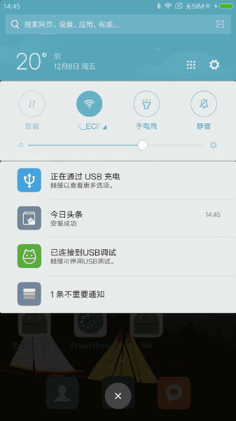

# APPTrack
xposed APP逆向跟踪工具，跟踪Activity&Fragment启动信息

项目正在完善中。。。

**已实现功能：**
- Activty&fragment信息跟踪
- 拖动悬浮隐藏

**待实现功能：**
- 日志导出


 


```
# 微信
12-08 14:56:41.450 5969-5969/com.tencent.mm I/Xposed: TrackLog: 源=[com.tencent.mm]目标=[com.tencent.mm.ui.LauncherUI]
12-08 14:56:41.651 5969-5969/com.tencent.mm I/Xposed: TrackLog: 当前Fragmnet=[com.tencent.mm.ui.conversation.j]
12-08 14:56:41.768 5969-5969/com.tencent.mm I/Xposed: TrackLog: 当前Fragmnet=[com.tencent.mm.ui.contact.AddressUI$a]
12-08 14:56:41.771 5969-5969/com.tencent.mm I/Xposed: TrackLog: 当前Fragmnet=[com.tencent.mm.ui.h]
12-08 14:56:41.774 5969-5969/com.tencent.mm I/Xposed: TrackLog: 当前Fragmnet=[com.tencent.mm.ui.y]
12-08 14:56:42.248 1068-1068/com.tencent.mm:appbrand0 I/Xposed: TrackLog: Package=[com.tencent.mm]
12-08 14:56:42.400 5969-5969/com.tencent.mm I/Xposed: TrackLog: 当前Fragmnet=[com.tencent.mm.ui.chatting.En_5b8fbb1e$a]
12-08 14:56:45.488 1221-1221/com.tencent.mm:tools I/Xposed: TrackLog: Package=[com.tencent.mm]
12-08 14:56:54.462 5969-5969/com.tencent.mm I/Xposed: TrackLog: 源=[com.tencent.mm]目标=[com.tencent.mm.plugin.sns.ui.En_424b8e16]
12-08 14:56:59.677 5969-5969/com.tencent.mm I/Xposed: TrackLog: 源=[com.tencent.mm]目标=[com.tencent.mm.ui.LauncherUI]
12-08 14:56:59.686 5969-5969/com.tencent.mm I/Xposed: TrackLog: 当前Fragmnet=[com.tencent.mm.ui.contact.AddressUI$a]
12-08 14:56:59.697 5969-5969/com.tencent.mm I/Xposed: TrackLog: 当前Fragmnet=[com.tencent.mm.ui.h]
12-08 14:56:59.725 5969-5969/com.tencent.mm I/Xposed: TrackLog: 当前Fragmnet=[com.tencent.mm.ui.y]
12-08 14:56:59.728 5969-5969/com.tencent.mm I/Xposed: TrackLog: 当前Fragmnet=[com.tencent.mm.ui.conversation.j]
12-08 14:56:59.730 5969-5969/com.tencent.mm I/Xposed: TrackLog: 当前Fragmnet=[com.tencent.mm.ui.chatting.En_5b8fbb1e$a]

```


站在wing神的肩膀上写代码，感谢项目上提供的思路。
